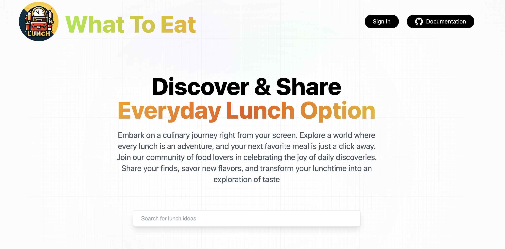

# Lunch Options App: WhatToEat

The WhatToEat App is a web application designed to help users discover and choose lunch options with ease. Built with React, Next.js, and MongoDB, it offers a simple interface where users can click a span to view a curated list of lunch options. This guide will cover how to set up the project, run it locally, and navigate its features.

## Features

> View the [Demo Video](https://youtu.be/xVK-zeScOwU)

[](https://youtu.be/xVK-zeScOwU)

- **User Authentication**: Access a secure login system allowing multiple users to experience tailored lunch options.
- **Responsive Design**: Enjoy a seamless experience across devices, with design optimization for both desktop and mobile platforms.
- **Search and Discover**: Effortlessly find your next lunch idea with a dynamic search functionality from the homepage. Choose to type in your cravings or explore using clickable tags to navigate the possibilities.
- **Inspire and Be Inspired**: Encounter a lunch idea that resonates? Easily add it to your collection with a simple click on the  icon.
- **Seamless Sharing**: Discover a lunch concept that strikes your fancy. Copy it to your clipboard with a quick click of the  icon, making sharing a breeze.
- **Explore User Creations**: Dive into the culinary world of others by clicking on their profile pictures. Uncover new lunch ideas and get inspired by the community.
- **Quick Pick**: Instantly select a lunch idea from your profile or someone else’s for those days when making a choice needs to be swift.
- **Personalize Your Contributions**: Enjoy full control over your lunch ideas with the ability to add, edit or delete them anytime, ensuring your contributions remain as fresh as your meals.

## Technology Stack

- **Frontend:** React.js, Next.js
- **Backend:** Node.js, Next.js API Routes
- **Database:** MongoDB
- **Authentication:** NextAuth.js (Optional for extended functionality)
- **Styling:** CSS Modules (or Tailwind CSS, styled-components, etc., if used)

## Prerequisites

Before you begin, ensure you have the following installed on your system:

- Node.js (v12.x or higher)
- npm (v6.x or higher) or yarn
- MongoDB (Local setup or MongoDB Atlas account)

## Getting Started

### 1. Clone the Repository

```bash
git clone https://github.com/HUIXIN-TW/WhatToEat.git
cd WhatToEat
```

### 2. Install Dependencies

```bash
npm install
# or
yarn install
```

### 3. Configure Environment Variables

Create a `.env.local` file at the root of your project and add the following:

```env
MONGODB_URI=your_mongodb_connection_string
NEXTAUTH_URL=http://localhost:3000
GOOGLE_ID=your_google_oauth_client_id
GOOGLE_CLIENT_SECRET=your_google_oauth_client_secret
NEXTAUTH_SECRET=your_random_secret
```

Replace `your_mongodb_connection_string` with your actual MongoDB connection string.

### 4. Run the Development Server

```bash
npm run dev
# or
yarn dev
```

Navigate to `http://localhost:3000` in your browser to see the app running.

## Usage

- **Viewing Lunch Options:** Simply click on the "Show Lunch Options" span on the homepage to display the list of available lunch options.
- **User Authentication:** (If implemented) Use the login/logout buttons to authenticate. Once logged in, you will see personalized lunch options based on your preferences.

## Deploying to Cloudflare

This project is a dynamic Next.js app. It uses NextAuth, MongoDB, and route handlers, so it should be deployed to **Cloudflare Workers with the OpenNext adapter**, not as a static export.

Suggested migration path:

1. Keep the current app stable locally first.
2. When you are ready to deploy, add the Cloudflare runtime dependencies:

```bash
npm i @opennextjs/cloudflare@latest
npm i -D wrangler@latest
```

3. Add a `wrangler.jsonc` file with:
   - a current `compatibility_date`
   - `nodejs_compat` enabled
4. Add `open-next.config.ts` using the Cloudflare adapter.
5. Add Cloudflare secrets for:
   - `MONGODB_URI`
   - `GOOGLE_ID`
   - `GOOGLE_CLIENT_SECRET`
   - `NEXTAUTH_SECRET`
   - `NEXTAUTH_URL`
6. Preview in the Workers runtime before cutover.
7. Deploy to Workers after validating auth and MongoDB connectivity end to end.

Important notes:

- Cloudflare recommends Workers for full-stack Next.js apps.
- Static Pages export is only appropriate for fully static Next.js sites.
- Because this app uses `mongoose`, you should verify the MongoDB path in the Workers runtime before switching production traffic.

References:

- https://developers.cloudflare.com/workers/framework-guides/web-apps/nextjs/
- https://developers.cloudflare.com/pages/framework-guides/nextjs/
- https://developers.cloudflare.com/pages/framework-guides/nextjs/deploy-a-static-nextjs-site/

## Contributing

Contributions are welcome! Please feel free to submit a pull request or open an issue for any bugs or feature requests.
